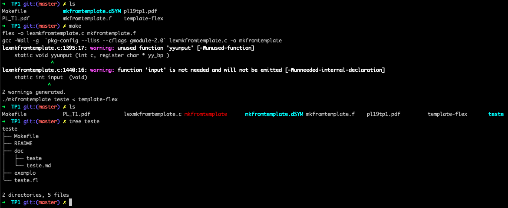
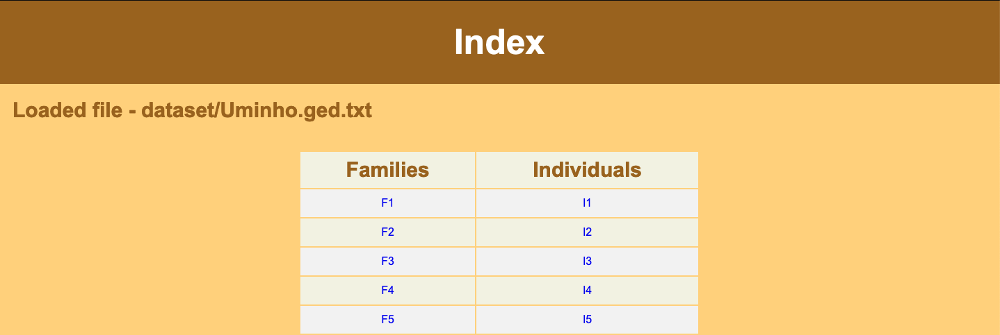
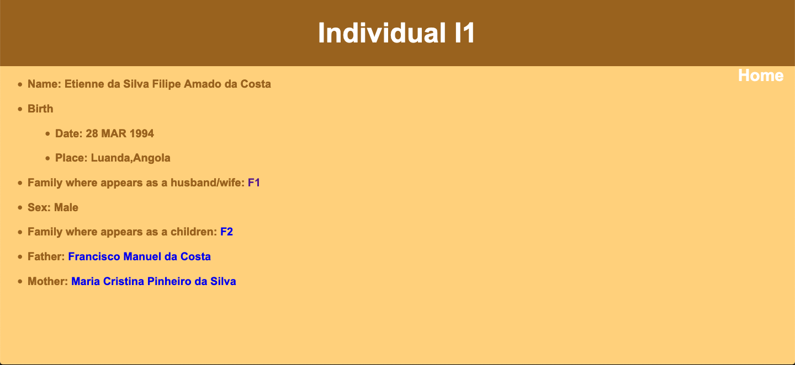
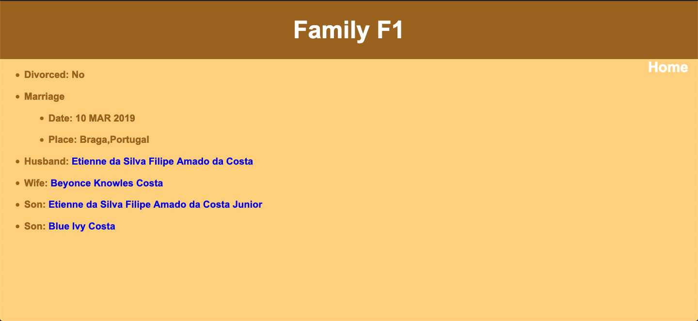

# PL

Flex & Yacc .

TEMPLATE MULTI-FILE (TP1)
========

* Para vários projectos de software, é habitual soluções envolvendo vário ficheiros, várias pastas. Exemplo : um ficheiro, uma makefile, um manual , uma pasta de exemplos, etc.
* Pretende-se criar um programa "mkfromtemplate", capaz de aceitar um nome de projecto , e um ficheiro descrição de um template multi-file e que crie os ficheiros e pastas iniciais do projecto.

Expected Result
------------------

Conversor de GEDCOM (TP2)
========

* Neste projecto, pretende-se que se desenvolva um conversor de GEDCOM 5.5 para XML/HTML de modo a poder mostrar de imediato numa página Web a árvore genealógica .

Home Page
------------------

Individual
------------------

Family
------------------

